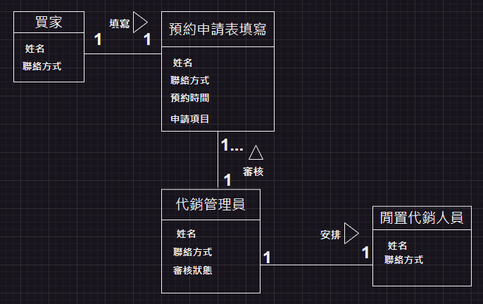

# 期中模擬考-期中-MidSample
>
>學號：111111224
> 
>姓名：邱武昱
> 
>作業撰寫時間： (mins，包含程式撰寫時間)
> 
>最後撰寫文件日期：2023/09/22
>

本份文件包含以下主題：(至少需下面兩項，若是有多者可以自行新增)
- [x] 說明內容
- [x] 個人認為完成作業須具備觀念

## 說明程式與內容
# 第一題
a.利害關係人表
| 利害人 | 目標 |  
|---|---|
孔菇莉代銷公司| 1.提升服務品質。 2.提高銷售效率。 3.減少人工疏失錯誤。 4.增加客戶滿意度。
代銷管理者|1.提高工作效率。 2.簡化時程安排。 3.減少人工疏失錯誤。 4.提供更好的服務給買家。
預約型買家|1.更便捷的預約流程。 2.確保看房時間。 3.提高預約成功率。 4.減少因時程錯誤而造成的不便。
現場即時參觀買家|1.即時獲得看房機會。 2.確保有合適的代銷接待。 3.提高看房效率。 4.減少分配不合理、等待時間過長。

事件表
|案例名稱|事件描述|
|---|---|
預約型買家申請成功|	預約型買家填寫申請後，後台管理者審核通過，安排了代銷接待，並將成功訊息推送給預約買家進行 Line 訊息推播。
預約型買家申請失敗|	預約型買家填寫申請後，後台管理者無法安排合適的時段，將失敗訊息推送給預約買家進行 Line 訊息推播，並要求重新填寫申請單。
現場即時參觀買家申請|現場即時參觀買家填寫申請後，後台管理者立即安排了閒置的代銷進行分配，並將對應的訊息推播至現場即時參觀買家。
代銷接待變更|  若有已安排的代銷無法接待，需立即進行變更，通知後台管理者重新分配接待代銷，並將新的訊息推播至相對應的買家。
申請審核過程|  後台管理者審核預約型買家或現場即時參觀買家的申請，確保時程無誤，並安排合適的代銷接待，如果無法安排，需通知買家重新填寫申請。
軟體更新|	軟體需不斷更新以應對市場需求和改變，包括改進功能、增加安全性等，需通知利害人進行相應的操作和更新。

b.使用案例圖  

c.使用案例
|使用案例名稱| 預約型買家申請成功|
|---|---|
使用案例描述| 預約型買家填寫申請後，後台管理者審核通過，安排了代銷接待，並將成功訊息推送給預約買家進行 Line 訊息推播。
主要參與者|預約型買家、後台管理者、代銷接待人員
利害關係人與目標|預約型買家：希望順利預約看房，確保被安排合適的時段和代銷接待人員。 後台管理者：確保時程安排無誤，適時地安排代銷接待人員，提供良好的服務品質。 代銷接待人員：負責接待預約型買家，提供專業的服務，促進房屋銷售。
前置條件|預約型買家已填寫完整的申請表格，包括手機號碼、姓名、期望被接待的日期與時段。
後置條件|預約型買家收到成功訊息，確認預約成功。
主要成功情節|後台管理者審核預約申請後，確認無誤。
例外情節與其他需求|若後台管理者無法安排合適的代銷接待人員，需要通知預約型買家重新填寫申請表格。

|使用案例名稱| 預約型買家申請失敗|
|---|---|
使用案例描述|預約型買家填寫申請後，後台管理者無法安排合適的時段，將失敗訊息推送給預約買家進行 Line 訊息推播，並要求重新填寫申請單。
主要參與者|預約型買家、後台管理者
利害關係人與目標|預約型買家：希望順利預約看房，確保被安排合適的時段和代銷接待人員。 後台管理者：確保時程安排無誤，並通知買家重新填寫申請單。
前置條件|預約型買家已填寫完整的申請表格，包括手機號碼、姓名、期望被接待的日期與時段。
後置條件|預約型買家收到失敗訊息，需要重新填寫申請單。
主要成功情節|後台管理者審核預約申請後，發現無法安排合適的時段。
例外情節與其他需求|若後台管理者無法安排合適的時段，但可以提供其他建議或安排，需與預約型買家進行溝通。

|使用案例名稱| 現場即時參觀買家申請|
|---|---|
使用案例描述|現場即時參觀買家填寫申請後，後台管理者立即安排了閒置的代銷進行分配，並將對應的訊息推播至現場即時參觀買家。
主要參與者|現場即時參觀買家、後台管理者、代銷接待人員
利害關係人與目標|現場即時參觀買家：希望能夠即時參觀房屋，確保有合適的代銷接待人員。 後台管理者：確保能夠迅速安排代銷接待，提供良好的服務品質。 代銷接待人員：負責即時接待現場參觀買家，提供專業的服務。
前置條件|現場即時參觀買家已填寫完整的申請表格，包括手機號碼、姓名。
後置條件|代銷接待人員準備好接待工作。
主要成功情節|後台管理者接收到現場即時參觀買家的申請後，立即安排了閒置的代銷進行分配。
例外情節與其他需求|若後台管理者無法立即安排合適的代銷接待人員，需要通知現場即時參觀買家可能會有延遲。

|使用案例名稱| 代銷接待變更|
|---|---|
使用案例描述|若有已安排的代銷無法接待，需立即進行變更，通知後台管理者重新分配接待代銷，並將新的訊息推播至相對應的買家
主要參與者|後台管理者、代銷接待人員
利害關係人與目標|後台管理者：確保能夠及時重新安排代銷接待，提供良好的服務品質。 代銷接待人員：接受新的接待任務，確保能夠提供專業的服務。 預約型買家、現場即時參觀買家：確保能夠順利接受接待，並獲得良好的服務體驗。
前置條件|已安排了代銷接待人員接待預約型買家或現場即時參觀買家。
後置條件|新的代銷接待人員準備好接待工作。
主要成功情節|後台管理者接收到代銷接待變更的通知後，立即重新分配接待任務給其他代銷。
例外情節與其他需求|若無法找到合適的代銷接待人員進行替換，需與預約型買家或現場即時參觀買家進行溝通並提供其他解決方案。

|使用案例名稱| 申請審核過程|
|---|---|
使用案例描述|後台管理者審核預約型買家或現場即時參觀買家的申請，確保時程無誤，並安排合適的代銷接待，如果無法安排，需通知買家重新填寫申請。
主要參與者|後台管理者、預約型買家、現場即時參觀買家
利害關係人與目標|後台管理者：確保能夠及時審核並安排合適的代銷接待，提供良好的服務品質。 預約型買家、現場即時參觀買家：確保能夠順利獲得審核通過並安排接待，並獲得良好的服務體驗。 
前置條件|預約型買家或現場即時參觀買家已填寫完整的申請表格，包括必要的資訊。
後置條件|預約型買家或現場即時參觀買家獲得審核通過，並成功安排接待。
主要成功情節|審核通過的預約型買家或現場即時參觀買家收到通知，準備前往看房。
例外情節與其他需求|若後台管理者無法安排合適的代銷接待，需與預約型買家或現場即時參觀買家進行溝通並提供其他解決方案。

|使用案例名稱| 軟體更新|
|---|---|
使用案例描述|系統管理者進行軟體更新，以應對市場需求和改變，包括改進功能、增加安全性等，並通知相關利害關係人進行相應的操作和更新。
主要參與者|系統管理者、使用者
利害關係人與目標|系統管理者：確保系統持續運作良好，提供優質的服務。 使用者：期待系統更新後能夠擁有更好的使用體驗和功能。 系統開發團隊：確保更新後系統的穩定性和安全性。
前置條件|系統管理者擁有適當的權限和訪問系統的許可。
後置條件|系統更新完成並通知相關使用者。
主要成功情節|系統管理者確認系統更新的時間和範圍。
例外情節與其他需求|若系統更新過程中出現錯誤或意外情況，系統管理者需要立即通知相關人員並採取適當的措施。

d.初步類別圖  

# 第二題  
a.利害人關係表
| 利害人 | 目標 |
|---|---|
政府機關|1.實現政府政策目標。 有效管理資源2。 3.提供民眾福利。 4.增加民眾對政府的信任。
民眾|1.順利申請並領取補助金。 2.提高生活品質。 3.簡化申請程序。 4.保障個人資料安全。
金融機構|1.確保申請者提供的金融資訊準確無誤。 2.提供便利的申請流程。 3.採取適當的資訊安全措施，維護客戶隱私。 4.與政府機關及其他相關單位進行技術整合。
健保局|1.確保申請者提供的健保卡號與身份證字號或居留證號是否一致。 2.確保健保局所持有的申請者個人資料得到安全保護。 3.提升健保局系統的效能和安全性。 4.配合政府的政策要求，積極參與補助金發放流程。  

事件表
|案例名稱|事件描述|
|---|---|
健保卡與身份證資料比對失敗|申請者提供的健保卡號與身份證字號或居留證號無法在健保局系統中比對成功，可能是因為資料不一致、資料錯誤等原因。
金融帳戶核對失敗|申請者提供的金融代號與金融機構的帳戶資訊不符，可能是因為填寫錯誤、帳戶不存在等原因。
不良設計導致使用困難|前台設計不易使用，申請者在填寫資料或確認資訊時遇到困難，影響申請流程，降低系統效率，可能導致申請者放棄申請或增加後台人力成本。
違法行為揭露風險|系統中的個人資料被濫用或洩漏，政府、金融機構、健保局等單位面臨法律責任與公眾信任危機，可能造成法律訴訟、罰款等後果。
b.使用案例圖    

c.使用案例  

